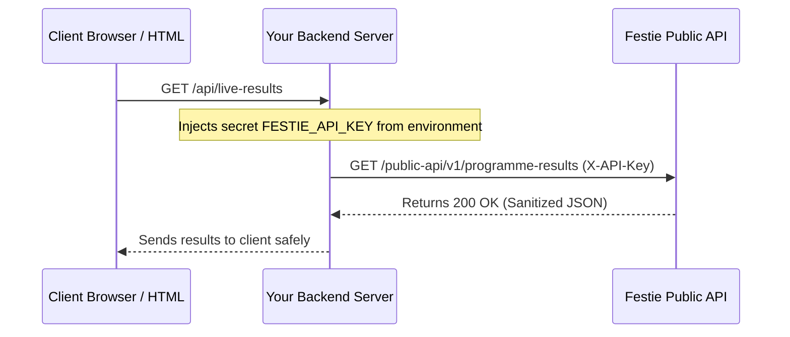

Festie Public API uses secret API keys to authenticate developer requests. Each API key belongs to a specific festival and carries individual rate limits and usage tracking.

## Generating an API Key

To generate an API key for your festival:

<Steps>
  <Step title="Navigate to Festival Settings">
    In the Festie admin portal, click **Settings** from the sidebar menu, then select the **API Keys** tab.
  </Step>
  <Step title="Verify Subscription Feature">
    Ensure your festival's plan includes the **Developer API** feature. If needed, upgrade to an eligible plan in **Billing**.
  </Step>
  <Step title="Create API Key">
    Enter a recognizable name for the key (e.g. `Stage-LED-Display` or `Mobile-App-Client`). Optionally choose an expiration date and time, then click **Create**.
  </Step>
  <Step title="Copy and Store Key Securely">
    Your raw API key will be displayed once. Copy and save it in your environment variables or secret manager.
  </Step>
</Steps>

<Warning>
  Festie stores only a cryptographic hash of your API key. You cannot view the raw key after navigating away from the creation screen. If a key is compromised or lost, revoke it immediately and generate a new one.
</Warning>

## Server-Side Only Calling Policy

<Warning>
  **Direct Client-Side / HTML Browser Calls Are Strictly Disallowed**

  You must **NEVER** embed or make Festie Public API calls directly from client-side browser files (such as an `.html` file, browser `<script>` tag, or client-side single page app).

  **Why browser-side calls are not allowed:**
  1. **Security Vulnerability:** Any visitor opening browser DevTools (Inspect > Network) can see your `X-API-Key` and copy it.
  2. **Quota Hijacking:** Once compromised, an attacker can exhaust your festival's daily and monthly API quotas.
  3. **No Direct Browser Access:** The Festie Developer API does not allow open cross-origin client usage with raw secrets.
</Warning>

### Recommended Architecture: Backend Proxy

Always route your requests through your own secure backend server:



#### Next.js Route Handler Example (`app/api/results/route.ts`)

```typescript
import { NextResponse } from "next/server";

export async function GET() {
  const res = await fetch("https://api.festie.app/public-api/v1/summary?subFestSlug=arts-2026", {
    headers: {
      "X-API-Key": process.env.FESTIE_API_KEY!, // Safe on the server!
    },
    next: { revalidate: 30 }, // Cache server-side for 30s
  });

  const data = await res.json();
  return NextResponse.json(data);
}
```

## Authenticating Requests

Send your API key in the `X-API-Key` HTTP header with every request:

<CodeGroup>
```bash cURL
curl -X GET "https://api.festie.app/public-api/v1/subfests" \
  -H "X-API-Key: fst_live_abcdef1234567890" \
  -H "Accept: application/json"
```

```typescript TypeScript / JavaScript
const response = await fetch("https://api.festie.app/public-api/v1/subfests", {
  method: "GET",
  headers: {
    "X-API-Key": process.env.FESTIE_API_KEY!,
    "Accept": "application/json",
  },
});

if (!response.ok) {
  throw new Error(`API error: ${response.statusText}`);
}

const result = await response.json();
console.log(result.data);
```

```python Python
import os
import requests

api_key = os.environ.get("FESTIE_API_KEY")
headers = {
    "X-API-Key": api_key,
    "Accept": "application/json",
}

response = requests.get(
    "https://api.festie.app/public-api/v1/subfests",
    headers=headers,
)
response.raise_for_status()

data = response.json()
print(data["data"])
```
</CodeGroup>

## Rate Limiting & Quotas

Festie protects API availability with a dual-layer quota mechanism:

### 1. Per-Minute Rate Limit
Each key is allocated a per-minute rate limit (defaults to `60` requests per minute, or as configured in your festival key settings). If exceeded within a 60-second sliding window, the API responds with:

```json
{
  "statusCode": 429,
  "message": "Too Many Requests"
}
```

### 2. Plan Quotas & Response Headers
Every successful API response includes custom headers indicating your daily and monthly quota status:

| Header | Description |
| :--- | :--- |
| `X-Public-API-Access-Mode` | Identifies your access mode (`API_KEY`). |
| `X-Public-API-Daily-Limit` | Total requests allowed per UTC calendar day. |
| `X-Public-API-Daily-Remaining` | Remaining requests available in the current day. |
| `X-Public-API-Daily-Reset` | UTC ISO timestamp when the daily counter resets (e.g. `2026-09-04T00:00:00.000Z`). |
| `X-Public-API-Monthly-Limit` | Total requests allowed in the current calendar month. |
| `X-Public-API-Monthly-Remaining` | Remaining requests available in the current month. |
| `X-Public-API-Monthly-Reset` | UTC ISO timestamp when the monthly counter resets. |

### Sample Header Inspection

```http
HTTP/1.1 200 OK
Content-Type: application/json; charset=utf-8
X-Public-API-Access-Mode: API_KEY
X-Public-API-Daily-Limit: 10000
X-Public-API-Daily-Remaining: 9845
X-Public-API-Daily-Reset: 2026-09-04T00:00:00.000Z
X-Public-API-Monthly-Limit: 250000
X-Public-API-Monthly-Remaining: 247890
X-Public-API-Monthly-Reset: 2026-10-01T00:00:00.000Z
```

<Tip>
  Inspect `X-Public-API-Daily-Remaining` in your client code to dynamically back off or cache responses when remaining requests run low.
</Tip>

