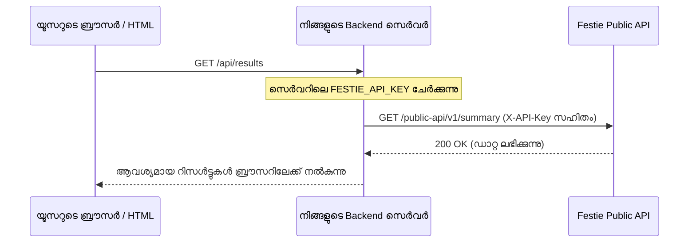

Festie Public API ഉപയോഗിക്കുന്നതിന് ഒരു സീക്രെട്ട് API Key ആവശ്യമാണ്. നിങ്ങളുടെ ഫെസ്റ്റിവലുമായി ബന്ധിപ്പിച്ചിട്ടുള്ള ഈ കീ ഉപയോഗിച്ചാണ് സുരക്ഷയും റേറ്റ് ലിമിറ്റുകളും ക്വാട്ടകളും കണക്കാക്കുന്നത്.

## API Key ഉണ്ടാക്കുന്ന വിധം

നിങ്ങളുടെ ഫെസ്റ്റിവലിനായി ഒരു API കീ ഉണ്ടാക്കാൻ താഴെ പറയുന്ന പടികൾ ചെയ്യുക:

<Steps>
  <Step title="API Keys പേജിലേക്ക് പോവുക">
    Festie അഡ്മിൻ ഡാഷ്‌ബോർഡിലെ sidebar-ൽ നിന്ന് **Settings** ക്ലിക്ക് ചെയ്യുക, തുടർന്ന് **API Keys** ടാബ് തിരഞ്ഞെടുക്കുക.
  </Step>
  <Step title="സബ്സ്ക്രിപ്ഷൻ പരിശോധിക്കുക">
    നിങ്ങളുടെ ഫെസ്റ്റിവലിന്റെ പ്ലാനിൽ **Developer API** ഫീച്ചർ ഉണ്ടെന്ന് ഉറപ്പാക്കുക. ഇല്ലെങ്കിൽ **Billing**-ൽ പോയി അപ്ഗ്രേഡ് ചെയ്യാം.
  </Step>
  <Step title="പുതിയ കീ ക്രിയേറ്റ് ചെയ്യുക">
    **Create API Key** ക്ലിക്ക് ചെയ്ത് കീയ്ക്ക് ഒരു പേര് നൽകുക (ഉദാ: `College-Main-Server` അല്ലെങ്കിൽ `App-Backend`). വേണമെങ്കിൽ കീയുടെ കാലാവധി അവസാനിക്കുന്ന തീയതിയും (expiration date) സെറ്റ് ചെയ്യാം. തുടർന്ന് **Create** അമർത്തുക.
  </Step>
  <Step title="കീ കോപ്പി ചെയ്ത് സുരക്ഷിതമായി വെക്കുക">
    ക്രിയേറ്റ് ചെയ്യുമ്പോൾ ഒരു തവണ മാത്രമേ നിങ്ങളുടെ യഥാർത്ഥ API കീ കാണിക്കുകയുള്ളൂ. അത് ഉടൻ കോപ്പി ചെയ്ത് നിങ്ങളുടെ backend സെർവറിന്റെ `.env` ഫയലിൽ സൂക്ഷിക്കുക.
  </Step>
</Steps>

<Warning>
  സുരക്ഷയുടെ ഭാഗമായി Festie ഈ കീയുടെ ഹാഷ് (hash) മാത്രമേ ഡാറ്റാബേസിൽ സൂക്ഷിക്കുന്നുള്ളൂ. ഒരിക്കൽ ഈ പേജ് വിട്ടാൽ പിന്നീട് നിങ്ങൾക്ക് മുഴുവൻ കീയും കാണാൻ സാധിക്കില്ല. കീ നഷ്ടപ്പെടുകയോ ചോർന്നുപോവുകയോ ചെയ്താൽ അത് ഉടൻ **Revoke** ചെയ്ത് പുതിയത് ഉണ്ടാക്കുക.
</Warning>

## Server-Side Only നിയമം

<Warning>
  **ബ്രൗസറിൽ നിന്നോ HTML-ൽ നിന്നോ നേരിട്ട് API വിളിക്കാൻ അനുവാദമില്ല**

  നിങ്ങൾ ഒരിക്കലും നിങ്ങളുടെ വെബ്സൈറ്റിന്റെ frontend HTML ഫയലിലോ, `<script>` ടാഗിലോ, ക്ലയന്റ്-സൈഡ് ജാവാസ്ക്രിപ്റ്റിലോ ഈ API കീ ചേർക്കരുത്.

  - **എന്തുകൊണ്ട്?** ഏതൊരു ഉപയോക്താവിനും ബ്രൗസറിന്റെ Developer Tools (F12) ഓപ്പൺ ചെയ്ത് നിങ്ങളുടെ API Key മോഷ്ടിക്കാൻ സാധിക്കും.
  - മോഷ്ടിച്ച കീ ഉപയോഗിച്ച് നിങ്ങളുടെ പ്രതിദിന, പ്രതിമാസ API ക്വാട്ടകൾ അവർ തീർത്തു കളയാൻ സാധ്യതയുണ്ട്.
  - **പരിഹാരം:** എപ്പോഴും നിങ്ങളുടെ സ്വന്തം Backend സെർവർ (Node.js, Next.js, Python, Laravel, PHP മുതലായവ) വഴി Festie API കോൾ ചെയ്യുക. ശേഷം ലഭിച്ച ഡാറ്റ നിങ്ങളുടെ വെബ്സൈറ്റിലേക്ക് നൽകുക.
</Warning>

### ശരിയായ രീതി: Backend Proxy



#### Next.js Route Handler ഉദാഹരണം (`app/api/results/route.ts`)

```typescript
import { NextResponse } from "next/server";

export async function GET() {
  // സെർവറിൽ മാത്രമേ ഈ കീ ഉപയോഗിക്കാവൂ
  const res = await fetch("https://api.festie.app/public-api/v1/summary?subFestSlug=arts-2026", {
    headers: {
      "X-API-Key": process.env.FESTIE_API_KEY!,
    },
    next: { revalidate: 30 }, // 30 സെക്കൻഡ് കാഷെ ചെയ്യാം
  });

  const data = await res.json();
  return NextResponse.json(data);
}
```

## റിക്വസ്റ്റ് അയക്കുന്ന വിധം

നിങ്ങളുടെ backend സെർവറിൽ നിന്ന് API വിളിക്കുമ്പോൾ `X-API-Key` എന്ന ഹെഡർ നൽകുക:

<CodeGroup>
```bash cURL
curl -X GET "https://api.festie.app/public-api/v1/subfests" \
  -H "X-API-Key: fst_live_abcdef1234567890" \
  -H "Accept: application/json"
```

```typescript TypeScript / Node.js
const response = await fetch("https://api.festie.app/public-api/v1/subfests", {
  method: "GET",
  headers: {
    "X-API-Key": process.env.FESTIE_API_KEY!,
    "Accept": "application/json",
  },
});

if (!response.ok) {
  throw new Error(`API error: ${response.statusText}`);
}

const result = await response.json();
console.log(result.data);
```

```python Python
import os
import requests

api_key = os.environ.get("FESTIE_API_KEY")
headers = {
    "X-API-Key": api_key,
    "Accept": "application/json",
}

response = requests.get(
    "https://api.festie.app/public-api/v1/subfests",
    headers=headers,
)
response.raise_for_status()

data = response.json()
print(data["data"])
```
</CodeGroup>

## റേറ്റ് ലിമിറ്റുകളും ക്വാട്ടകളും

Festie API സിസ്റ്റത്തിൽ രണ്ട് തരം നിയന്ത്രണങ്ങളുണ്ട്:

### 1. ഒരു മിനിറ്റിലുള്ള ലിമിറ്റ് (Rate Limit)
ഓരോ API കീയ്ക്കും മിനിറ്റിൽ ചെയ്യാവുന്ന പരമാവധി റിക്വസ്റ്റുകൾ നിശ്ചയിച്ചിട്ടുണ്ട് (സാധാരണയായി മിനിറ്റിൽ `60` റിക്വസ്റ്റുകൾ). ഇതിൽ കൂടുതൽ വന്നാൽ API `429 Too Many Requests` മറുപടി നൽകും:

```json
{
  "statusCode": 429,
  "message": "Too Many Requests"
}
```

### 2. ക്വാട്ട ഹെഡറുകൾ (Quota Headers)
ഓരോ വിജയകരമായ റെസ്പോൺസിലും ബാക്കിയുള്ള ക്വാട്ടകൾ അറിയാൻ താഴെ പറയുന്ന HTTP ഹെഡറുകൾ ഉണ്ടാകും:

| ഹെഡർ | വിവരണം |
| :--- | :--- |
| `X-Public-API-Access-Mode` | ആക്സസ് മോഡ് (`API_KEY`). |
| `X-Public-API-Daily-Limit` | ഒരു ദിവസം (UTC) അനുവദിച്ചിട്ടുള്ള ആകെ റിക്വസ്റ്റുകൾ. |
| `X-Public-API-Daily-Remaining` | ഇന്നത്തെ ദിവസത്തിൽ ഇനി ബാക്കിയുള്ള റിക്വസ്റ്റുകൾ. |
| `X-Public-API-Daily-Reset` | ഈ ദിവസത്തെ ക്വാട്ട റീസെറ്റ് ആകുന്ന സമയം (UTC ISO timestamp). |
| `X-Public-API-Monthly-Limit` | ഒരു മാസത്തിൽ അനുവദിച്ചിട്ടുള്ള ആകെ റിക്വസ്റ്റുകൾ. |
| `X-Public-API-Monthly-Remaining` | ഈ മാസം ഇനി ബാക്കിയുള്ള റിക്വസ്റ്റുകൾ. |
| `X-Public-API-Monthly-Reset` | മാസ ക്വാട്ട റീസെറ്റ് ആകുന്ന സമയം. |

